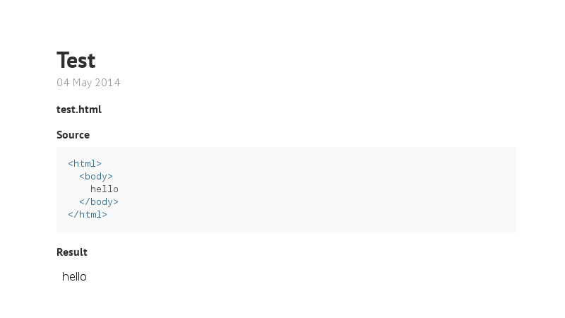

# jekyll_example_embed

Display the code for and result of an example.



## Installation

NB: This plugin will only run on the edge version of Jekyll.

1.  Add this line to your application's Gemfile `gem 'jekyll_example_embed'`.
2.  And then execute `bundle`.
3.  Add the following to your `_config.yml`: `gems: [jekyll_example_embed]`.
4.  Run `mkdir -p _collections/examples`
5.  Set up an examples collection:

```
collections:
  examples:
    output: true
```

## Usage

Make separate directories within `_collections/examples` for each language you
would like to prcoess. The directory is used to highlight the code therein,
and, as such, is necessary for proper output.

The example itself will be rendered in an iframe, giving it a separate
execution context from the rest of the page. This will allow multiple examples
to be displayed on the same page, even if they are progressions on a theme and
contain duplicate variables.

## Contributing

1. Fork it ( https://github.com/[my-github-username]/jekyll_example_embed/fork )
2. Create your feature branch (`git checkout -b my-new-feature`)
3. Commit your changes (`git commit -am 'Add some feature'`)
4. Push to the branch (`git push origin my-new-feature`)
5. Create a new Pull Request

